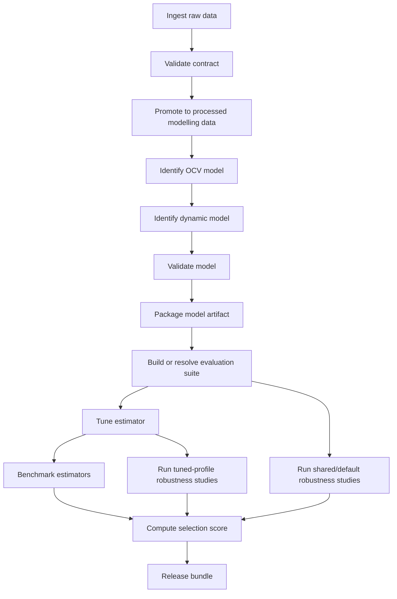

# Desktop ATL20 BSS V1 Workflow

## Purpose

This is the canonical end-to-end workflow surface for the ATL desktop suite built around:

- evaluation suite: [`data/evaluation/processed/desktop_atl20_bss_v1/nominal/esc_bus_coreBattery_dataset.mat`](../../data/evaluation/processed/desktop_atl20_bss_v1/nominal/esc_bus_coreBattery_dataset.mat)
- current released desktop model: [`models/ATLmodel.mat`](../../models/ATLmodel.mat)

It documents how the existing repo layers connect from raw-data ingest through model build, evaluation, robustness studies, and bundle release.

## End-To-End DAG

## Stage Map

| Stage | Purpose | Primary entry point(s) | Main inputs | Main outputs |
| --- | --- | --- | --- | --- |
| Ingest raw data | Load raw modelling and evaluation source data into repo workflows | builder/conversion scripts under `data/...` and layer-specific helpers | `data/modelling/raw/...`, `data/evaluation/raw/...` | in-memory source structs |
| Validate contract | Normalize and validate source-profile fields before identification or dataset build | layer-specific preprocessing inside `ocv_id`, `ESC_Id`, and evaluation builders | raw source structs | contract-clean traces used by builders |
| Promote to processed modelling data | Materialize canonical OCV and dynamic-identification inputs | processed-data builders and promoted files under `data/modelling/processed/...` | raw modelling data | `data/modelling/processed/ocv/...`, `data/modelling/processed/dynamic/...` |
| Identify OCV model | Fit reusable OCV curves for the chosen chemistry and method | [`ocv_id/runOcvIdentification.m`](../../ocv_id/runOcvIdentification.m) | processed OCV data, OCV engine choice | reusable OCV model under `data/modelling/derived/ocv_models/...` |
| Identify dynamic model | Fit an ESC dynamic model from the OCV artifact and dynamic datasets | [`ESC_Id/runDynamicIdentification.m`](../../ESC_Id/runDynamicIdentification.m) | reusable OCV model, processed dynamic data | ESC identification results and candidate ESC model |
| Validate model | Check the dynamic model on modelling or application datasets | [`ESC_Id/ESCvalidation.m`](../../ESC_Id/ESCvalidation.m), [`ESC_Id/runESCvalidation.m`](../../ESC_Id/runESCvalidation.m) | candidate ESC model, validation dataset | validation summary and saved validation result |
| Package model artifact | Promote or retain the chosen model file as the active released model | repo release step around `models/*.mat` | validated candidate model | released model artifact such as [`models/ATLmodel.mat`](../../models/ATLmodel.mat) |
| Build or resolve evaluation suite | Reuse the canonical processed suite or rebuild it from the raw profile and active model | [`data/evaluation/synthetic/ESCSimData/BSSsimESCdata.m`](../../data/evaluation/synthetic/ESCSimData/BSSsimESCdata.m) | raw evaluation profile, active ESC model | processed evaluation dataset under `data/evaluation/processed/...` |
| Tune estimator | Fit estimator covariance settings against the canonical suite | [`autotuning/runAutotuning.m`](../../autotuning/runAutotuning.m) | evaluation dataset, active model, estimator set | heavy autotuning MATs and promoted tuning summaries |
| Benchmark estimators | Compare the estimator set on the canonical suite | [`Evaluation/runBenchmark.m`](../../Evaluation/runBenchmark.m) | evaluation dataset, active model bundle, estimator registry/tuning | benchmark results MAT and promoted summary |
| Run shared/default robustness studies | Stress the estimator set with default or shared covariance settings, especially for init-SOC and injection reference studies | [`Evaluation/initSOCs/runInitSocStudy.m`](../../Evaluation/initSOCs/runInitSocStudy.m), [`Evaluation/NoiseTuningSweep/sweepNoiseStudy.m`](../../Evaluation/NoiseTuningSweep/sweepNoiseStudy.m), [`Evaluation/Injection/runInjectionStudy.m`](../../Evaluation/Injection/runInjectionStudy.m) | canonical suite, default/shared covariance settings, injection cases | promoted robustness summaries plus local heavy MAT outputs |
| Run tuned-profile robustness studies | Re-evaluate init-SOC and injection robustness after loading the Bayes-tuned estimator profile | [`Evaluation/initSOCs/runInitSocStudy.m`](../../Evaluation/initSOCs/runInitSocStudy.m), [`Evaluation/Injection/runInjectionStudy.m`](../../Evaluation/Injection/runInjectionStudy.m) | canonical suite, autotuning profile, injection cases | promoted tuned-profile robustness summaries plus local heavy MAT outputs |
| Compute selection score | Rank the bundle candidates from the promoted benchmark and robustness evidence | current documented weighting in [`results/EstimatorSelection.md`](../../results/EstimatorSelection.md) | promoted benchmark, tuning, init-SOC, noise, and injection summaries | weighted selection note |
| Release bundle | Expose the chosen estimator-model bundle as the current canonical desktop scenario | released model, promoted summaries, selection note | validated model artifact and promoted evidence | canonical desktop bundle surface in `models/`, `results/`, and workflow docs |

## Canonical ATL Desktop Artifacts

Current canonical paths involved in the desktop suite:

- raw evaluation source profile:
  [`data/evaluation/raw/omtlife8ahc_hp/Bus_CoreBatteryData_Data.mat`](../../data/evaluation/raw/omtlife8ahc_hp/Bus_CoreBatteryData_Data.mat)
- processed evaluation suite:
  [`data/evaluation/processed/desktop_atl20_bss_v1/nominal/esc_bus_coreBattery_dataset.mat`](../../data/evaluation/processed/desktop_atl20_bss_v1/nominal/esc_bus_coreBattery_dataset.mat)
- processed OCV inputs:
  [`data/modelling/processed/ocv/atl20`](../../data/modelling/processed/ocv/atl20)
- processed dynamic-identification inputs:
  [`data/modelling/processed/dynamic/atl20`](../../data/modelling/processed/dynamic/atl20)
- reusable OCV model root:
  [`data/modelling/derived/ocv_models/atl20`](../../data/modelling/derived/ocv_models/atl20)
- ESC identification result root:
  [`data/modelling/derived/identification_results/atl20`](../../data/modelling/derived/identification_results/atl20)
- ESC validation result root:
  [`data/modelling/derived/validation_results/esc`](../../data/modelling/derived/validation_results/esc)
- current released desktop ESC model:
  [`models/ATLmodel.mat`](../../models/ATLmodel.mat)
- desktop ROM model used when `ROM-EKF` is enabled:
  [`models/ROM_ATL20_beta.mat`](../../models/ROM_ATL20_beta.mat)
- current weighted selection note:
  [`results/EstimatorSelection.md`](../../results/EstimatorSelection.md)

## Current Default Entry Points

The current repo uses these stable entry points in the desktop workflow:

- OCV identification:
  [`ocv_id/runOcvIdentification.m`](../../ocv_id/runOcvIdentification.m)
- ESC dynamic identification:
  [`ESC_Id/runDynamicIdentification.m`](../../ESC_Id/runDynamicIdentification.m)
- ESC validation:
  [`ESC_Id/ESCvalidation.m`](../../ESC_Id/ESCvalidation.m)
- evaluation dataset build/rebuild:
  [`data/evaluation/synthetic/ESCSimData/BSSsimESCdata.m`](../../data/evaluation/synthetic/ESCSimData/BSSsimESCdata.m)
- autotuning:
  [`autotuning/runAutotuning.m`](../../autotuning/runAutotuning.m)
- benchmark:
  [`Evaluation/runBenchmark.m`](../../Evaluation/runBenchmark.m)
- injection study:
  [`Evaluation/Injection/runInjectionStudy.m`](../../Evaluation/Injection/runInjectionStudy.m)
- init-SOC study:
  [`Evaluation/initSOCs/runInitSocStudy.m`](../../Evaluation/initSOCs/runInitSocStudy.m)
- noise/covariance study:
  [`Evaluation/NoiseTuningSweep/sweepNoiseStudy.m`](../../Evaluation/NoiseTuningSweep/sweepNoiseStudy.m)

The current bundle example that exercises most of this flow is:

- [`examples/atl20_p25_bundle/run_atl20_p25_bundle.m`](../../examples/atl20_p25_bundle/run_atl20_p25_bundle.m)

## Where To Customize

Use the workflow skeleton in [`workflows/desktop_atl20_bss_v1.m`](../../workflows/desktop_atl20_bss_v1.m) when you want to keep the desktop workflow shape but swap one layer.

- Modelling technique:
  change the dynamic-identification stage or downstream `modelSpec` from the released ESC model to another model family or candidate artifact.
- OCV method:
  change `cfg.engine` in `runOcvIdentification.m` to another supported OCV engine such as `middleCurve`, `socAverage`, or `voltageAverage`.
- Modelling datasets:
  point the OCV and dynamic-identification configs at different `data/modelling/processed/...` inputs.
- Evaluation suite:
  swap `datasetSpec.dataset_file` to another canonical processed or derived evaluation suite.
- Estimator set:
  change `estimatorSetSpec.registry_name`, explicit estimator lists, or autotuning estimator selections.
- Injection cases:
  edit `cfg.scenarios(k).injection_cases` in the Injection layer, including `additive_measurement_noise`, `sensor_gain_bias_fault`, and `composite_measurement_error`.
- Robustness studies:
  enable or disable init-SOC, noise, and injection stages independently, and choose whether init-SOC and injection run with shared/default covariances, tuned-profile covariances, or both. The noise-sweep layer is already a covariance study; in the canonical skeleton it can be run with shared/default non-swept settings or an alternate tuned-reference supporting config.

## Expected Promoted Outputs

Typical promoted desktop artifacts live under `results/...`:

- autotuning summaries under `results/autotuning/desktop_atl20_bss_v1/...`
- benchmark summaries under `results/evaluation/desktop_atl20_bss_v1/...`
- robustness-study summaries under `results/evaluation/desktop_atl20_bss_v1/...`
  these may include shared/default and tuned-profile init-SOC or injection variants as separate scenario ids
- weighted selection note in [`results/EstimatorSelection.md`](../../results/EstimatorSelection.md)

The current repo performs documented weighted selection in [`results/EstimatorSelection.md`](../../results/EstimatorSelection.md). A formal Pareto-front selection artifact is still to be implemented.

## Related Layer Docs

- [`README.md`](../../README.md)
- [`docs/architecture.md`](../architecture.md)
- [`ocv_id/README.md`](../../ocv_id/README.md)
- [`ESC_Id/README.md`](../../ESC_Id/README.md)
- [`Evaluation/README.md`](../../Evaluation/README.md)
- [`Evaluation/Injection/README.md`](../../Evaluation/Injection/README.md)
- [`Evaluation/initSOCs/README.md`](../../Evaluation/initSOCs/README.md)
- [`Evaluation/NoiseTuningSweep/README.md`](../../Evaluation/NoiseTuningSweep/README.md)
- [`autotuning/README.md`](../../autotuning/README.md)
